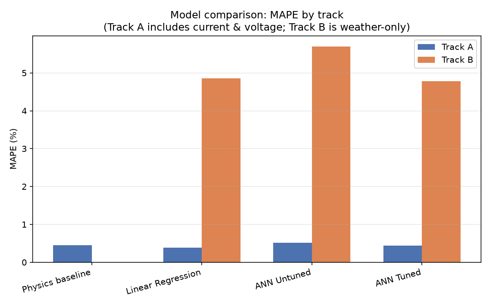
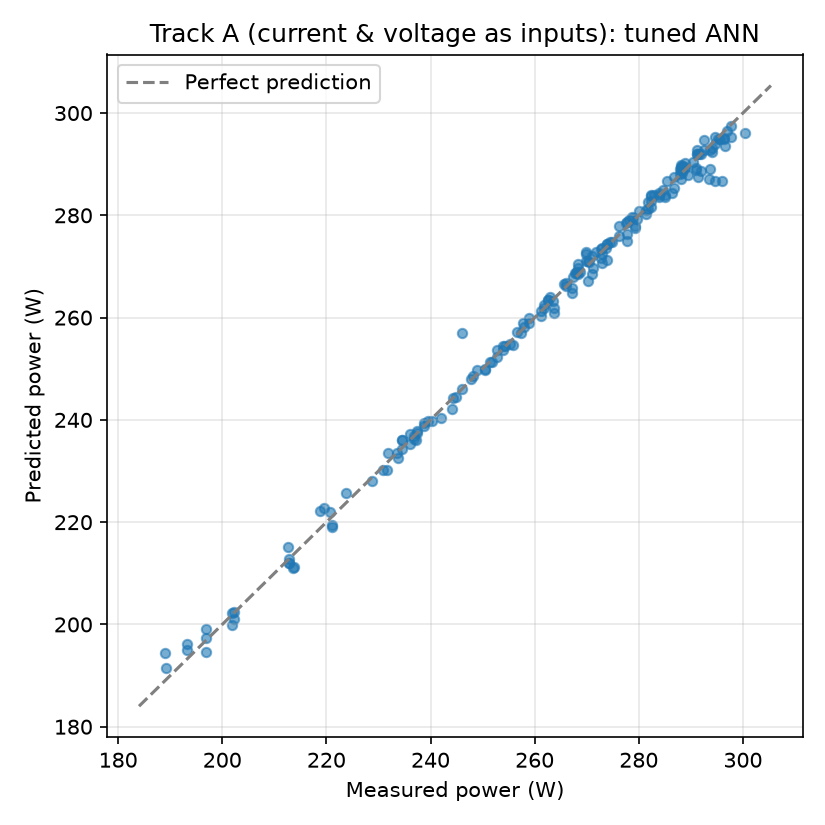
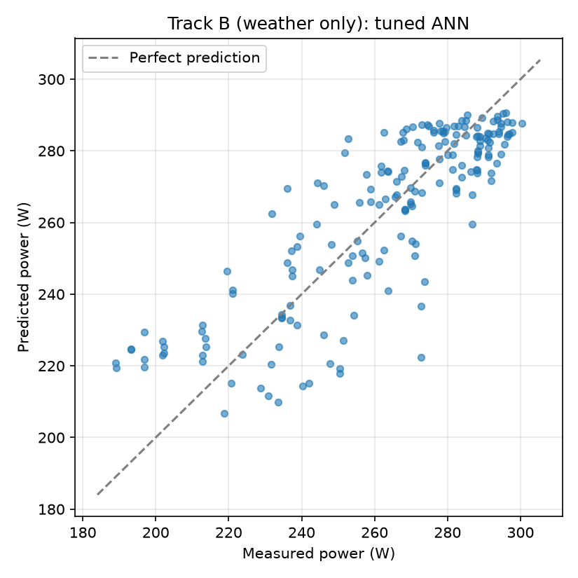
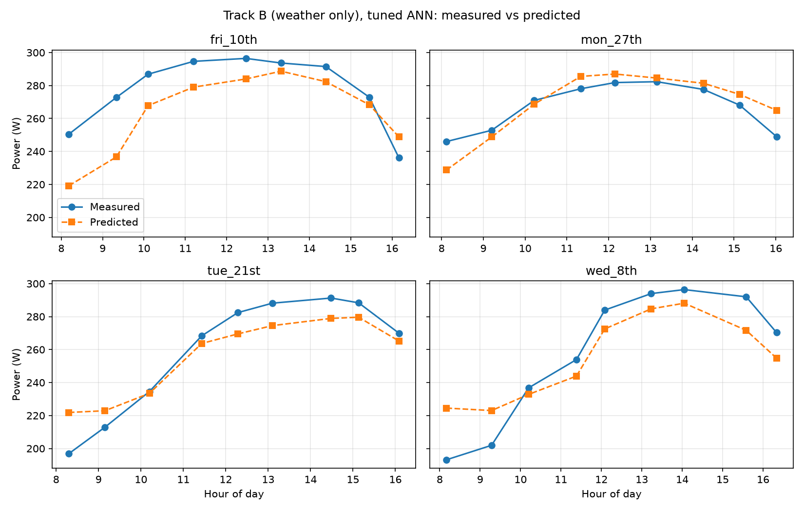

# Solar Power Forecasting: Python Reimplementation and Audit

A Python reimplementation and re-evaluation of an earlier MATLAB feedforward-ANN
project for solar power forecasting. The original MATLAB project is here:
[https://github.com/OluwafisayoIbrahim/ANN-Forecasting-for-Solar-Power].

## Background

The original project trained a feedforward Artificial Neural Network (ANN) in
MATLAB to forecast solar power output from environmental and electrical
measurements, reporting a Mean Absolute Percentage Error (MAPE) of 0.32%–0.60%.

Revisiting the project in Python surfaced a methodological issue with that
original evaluation (see **Key finding** below). This repository reimplements
the analysis with corrected, held-out validation, and reports what the ANN can
and cannot actually predict.

## Dataset

- 21 days of measurements, 9 readings per day (8am–4pm), 189 rows total
- Collected with pyranometers, solar panels and multimeters at Olabisi Onabanjo
  University
- Columns: `time, solar_irradiance, temperature, humidity, current, voltage, power`

Raw data: `data/raw/`. Combined, cleaned data: `data/processed/solar_data_combined.csv`,
produced by `src/load_data.py`.

## Key finding: Power ≈ Current × Voltage

`power` is almost exactly the product of `current` and `voltage` (that's simple
physics — P = IV). The original MATLAB model used current and voltage as ANN
*inputs* to predict power as the *output*. A model given both of those inputs
isn't really forecasting; it has a shortcut available that makes the problem
close to trivial. Consistent with this, a plain calculation of
`current × voltage` (no learning at all) reaches 0.45% MAPE on this data —
almost the same accuracy the original ANN reported.

This repository reports two tracks so the effect is visible directly.

## Track A vs. Track B

| Track | Inputs | Purpose |
|---|---|---|
| **A — replication** | irradiance, current, voltage, temperature, humidity | Matches the original MATLAB inputs. Included to show what the leakage does. |
| **B — weather only** | irradiance, temperature, humidity, hour of day | Removes current and voltage. This is the actual forecasting problem: predicting power from conditions alone. |

## Validation

With only 189 rows from 21 days, how the data is split matters a lot:

- **Grouped, by day:** all readings from a given day are kept together, in
  either training or testing, never split across both (`GroupKFold` on a
  `day_id`, 7 folds of 3 days each). This prevents same-day readings from
  leaking between train and test.
- **Nested tuning:** the ANN's hidden layer size and L2 regularization strength
  are chosen using only the training days in each fold (inner 3-fold grouped
  CV), never the held-out days. This keeps model selection honest.
- **Multiple seeds:** ANN results are averaged over 3 random initializations,
  since a network this small on this little data is sensitive to the seed.
- Metrics are computed on **pooled out-of-fold predictions** (every one of the
  189 rows predicted exactly once, while its day was held out), not averaged
  per fold, since per-fold R² on 3-day folds is unstable.

## Models compared

- **Physics baseline** (Track A only): `current × voltage`, no learning
- **Linear regression**
- **ANN, untuned**: 10 hidden units, `tanh` activation, `lbfgs` solver, no
  regularization — the closest practical match to the original MATLAB
  `fitnet(10)` (scikit-learn has no Levenberg-Marquardt solver, so `lbfgs`
  is used as the nearest available second-order alternative)
- **ANN, tuned**: hidden size (3 or 10) and L2 penalty (0.1, 1, 10) chosen
  by nested cross-validation

## Results



| Track | Model | MAE (W) | RMSE (W) | MAPE (%) | R² |
|---|---|---|---|---|---|
| A | Physics baseline | 1.168 | 1.321 | 0.445 | 0.998 |
| A | Linear Regression | 0.992 | 1.245 | 0.382 | 0.998 |
| A | ANN, untuned | 1.319 | 3.814 | 0.518 | 0.978 |
| A | ANN, tuned | 1.141 | 1.574 | 0.442 | 0.997 |
| B | Linear Regression | 12.165 | 15.149 | 4.854 | 0.701 |
| B | ANN, untuned | 14.302 | 23.980 | 5.698 | 0.191 |
| B | ANN, tuned | 11.965 | 15.089 | 4.786 | 0.703 |

Full table: `results/metrics/model_comparison.csv`.





## Discussion

Track A achieves near-perfect accuracy across every model, including the
no-learning physics baseline, because current and voltage make power almost
directly computable rather than forecastable. This confirms the leakage
described above and reproduces the original MATLAB project's low error
figures for the reasons given there.

Once current and voltage are excluded (Track B), errors rise substantially
and become more realistic for a genuine forecasting task. Here, model choice
matters: the untuned ANN — architecturally the closest match to the original
MATLAB network — is the *worst* performer of the three (5.70% MAPE, R² 0.19),
overfitting the 170 or so training rows available in each fold. Once tuned
against that overfitting, the ANN (4.79% MAPE, R² 0.70) performs about the
same as plain linear regression (4.85% MAPE, R² 0.70). On a dataset this
size, there is no evidence that a neural network offers a meaningful
advantage over a simpler model, and an unregularized one performs
measurably worse.

The daily profile plots show the tuned Track B model tracking the general
shape of a day's power curve reasonably well, but with real, visible
deviation in magnitude on some days (see `fri_10th`, `fri_17th` in particular).

## Limitations

- 189 samples is a small dataset for any neural network; results should be
  read as indicative, not as a robust generalization claim.
- Weather features here are simple instantaneous readings (irradiance,
  temperature, humidity, hour); no lagged or forecasted weather variables
  were available.
- Grouped-by-day validation and a random row-based split give fairly similar
  results on this dataset, suggesting same-day leakage is not the dominant
  source of the original inflated numbers — the current/voltage leakage is.

## Repository structure

```
solar-power-prediction-python/
├── data/
│   ├── raw/                        # original per-day CSVs
│   └── processed/                  # combined, cleaned dataset
├── notebooks/
│   └── 01_data_exploration.ipynb
├── src/
│   ├── load_data.py                # load, clean, combine
│   ├── features.py                 # Track A / Track B feature definitions
│   ├── evaluate.py                 # MAE, RMSE, MAPE, R²
│   ├── models.py                   # ANN definition
│   ├── train_ann.py                # tuned/untuned ANN, grouped nested CV
│   ├── train_baselines.py          # physics + linear regression baselines
│   ├── save_results.py             # writes results/metrics/model_comparison.csv
│   ├── save_predictions.py         # writes results/predictions/*.csv
│   └── plots.py                    # writes results/figures/*.png
├── results/
│   ├── metrics/model_comparison.csv
│   ├── predictions/
│   └── figures/
├── requirements.txt
└── README.md
```

## How to run

```bash
pip install -r requirements.txt
python src/load_data.py
python src/save_results.py
python src/save_predictions.py
python src/plots.py
```

## Relationship to the original project

This project corrects and extends an earlier undergraduate MATLAB project. The original repository has been updated with a
note pointing to this correction. The original SSRN preprint has also been
revised accordingly: [https://papers.ssrn.com/sol3/papers.cfm?abstract_id=4771898].